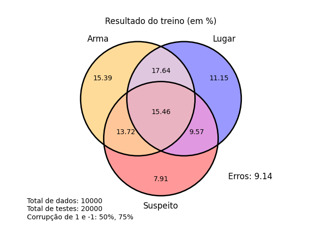

### Sobre Clue Card Game
Clue Card Game é um jogo de cartas, onde os jogadores passam por rodadas de perguntas e respostas em busca de descobrir o cenário do crime, composto por um suspeito, um lugar e uma arma.

### Instalação das dependêcias

On Windows

    python -m venv clue-env
    clue-env\Scripts\activate  # activate
    pip install scikit-learn
    pip install matplotlib-venn

On Linux 

    python3 -m venv clue-env
    source clue-env/bin/activate  # activate
    pip3 install scikit-learn
    pip3 install matplotlib-venn

### Exemplos da Execução

Nestes exemplos estão as porcentágens de acerto das cartas de acordo com a quantidade de treinamentos e de testes, levando também em consideração a quantidade de dados corrompidos (perdidos ou não descobertos), onde 1 representa uma certeza de que um jogador possui uma determinada carta enquando o -1 representa a certeza de que um jogador não possui uma.